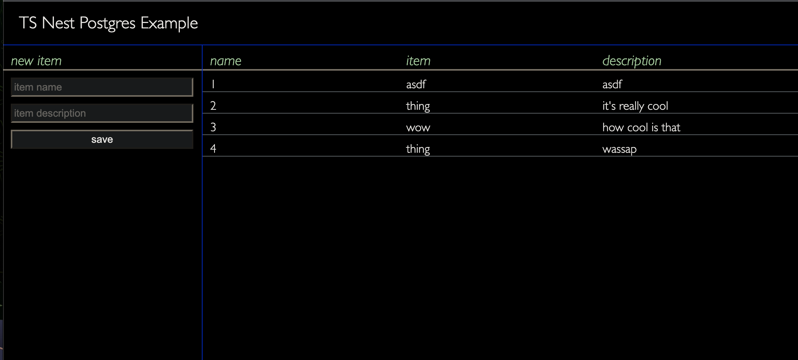

# TS Nest Postgres Example

This is an example project demonstrating how to build a simple application in TypeScript, Nest, and Postgres with a user interface and API.

## Getting Started
* Install NestJS: `npm i --global nest`
* clone this repo
* `cd` into project folder and `npm run start`